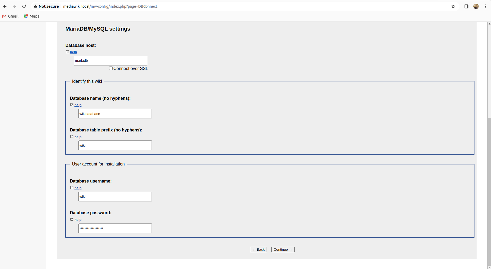

# MediaWiki Installation using Helm charts with custom docker images

## follow the below steps to setup MediaWiki in your local machine

1. Click on the below link and follow the steps to install docker desktop in your local machine.
[Docker Desktop Installation](https://docs.docker.com/desktop/install/linux-install/)

2. Enable kubernetes in docker desktop.


3. Install kubectl cli in your local machine.
[kubectl cli Installation](https://kubernetes.io/docs/tasks/tools/install-kubectl-linux/)

4. Install Helm Charts in your local machine.
[Helm Chart Installation](https://helm.sh/docs/intro/install/)

5. Install ingress-nginx from official kubernetes documentation.
[Nginx Ingress controller installation](https://github.com/kubernetes/ingress-nginx/blob/main/docs/deploy/index.md)

6. Build Docker image for the mediawiki application by running the following commands.
From repository's home directory
```
cd app;
docker build . -t mediawiki:1.0
```

[MediaWiki_Installation_Source](https://www.mediawiki.org/wiki/Manual:Running_MediaWiki_on_Red_Hat_Linux)

7. Build Docker image for mariadb by running the following commands.
From repository's home directory
```
cd db;
docker build . -t mediawiki-db:1.0
```


8. Run Helm Install command from the mediawiki-mariadb-chart directory.
From repository's home directory
```
cd mediawiki-mariadb-chart/
helm install mediawiki ./
```


9. Add the following entry into /etc/hosts.
```
127.0.0.1       mediawiki.local
```
10. kubectl cli output showing all the required resources are up and running.


11. You can access the mediaWiki site using the following link.
```
http://mediawiki.local/
```
12. MediaWiki setup and main page
Once you Access the site, you will see the below page

Click on setup the wiki. Now provide the MySQL credentials here.

Create the Admin user credentials

Click on install and you will end up in the page below

Download the file and copy it into the mediaWiki workspace directory inside the mediaWiki container
```
kubectl cp ~/Downloads/LocalSettings.php mediawiki-84bfdcf4c7-tb2vz:/var/www/html/
```
Now Click on the Home page to view the new MediaWiki Page


